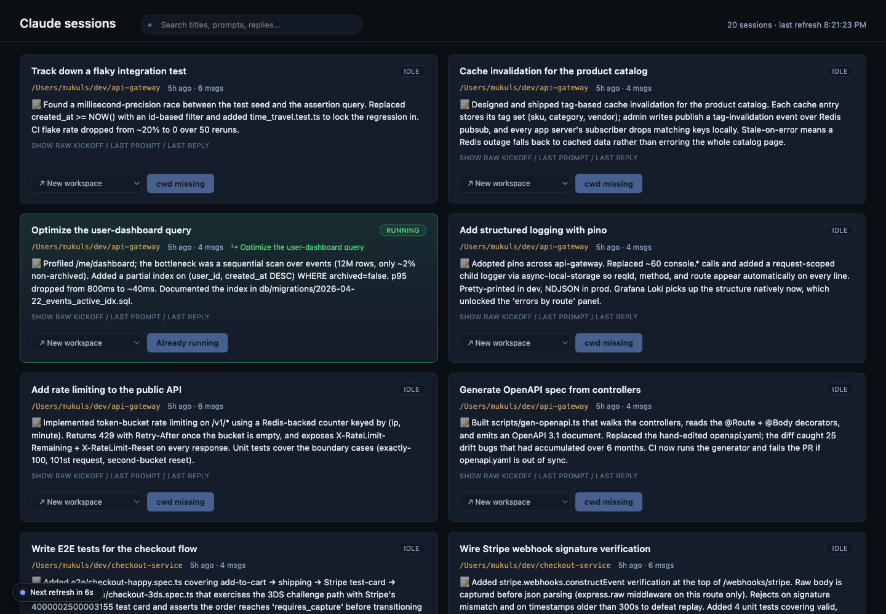
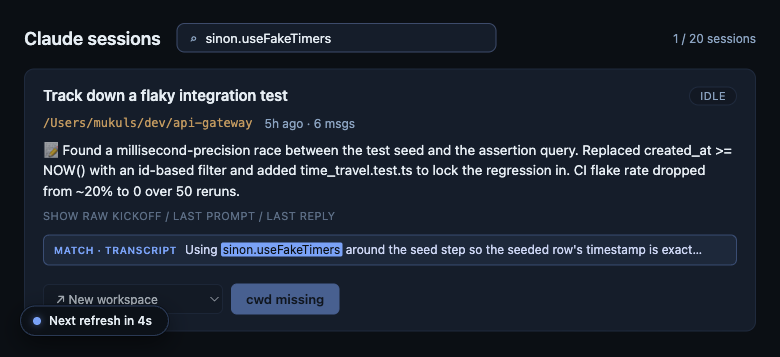
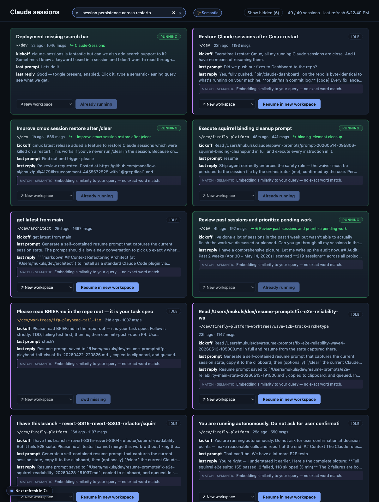
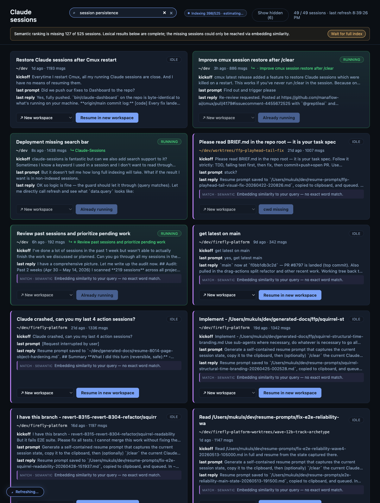
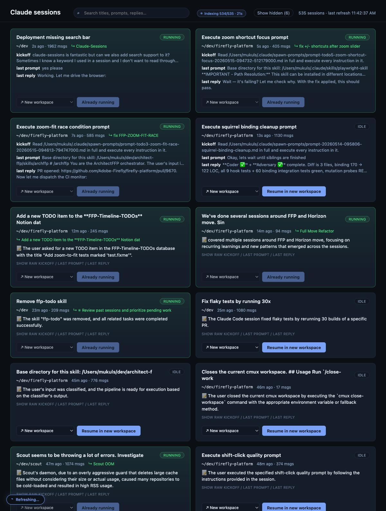

# claude-sessions

**Your 17 Claude Code sessions are not dead. They just look dead.**

When [cmux](https://cmux.com) quits, every Claude Code pane dies with it. You relaunch and find yourself staring at an empty sidebar — wondering which session was the bug hunt, which was the refactor, which was the one you were two minutes from finishing.

`claude --resume` won't save you either. It only grabs the most-recent session per directory, which is hilarious if you run five sessions in the same repo at once (hi, monorepo people).

This repo is the small toolkit I built so that never happens again.

[](https://www.apple.com/macos/)
[](https://www.python.org/)
[](LICENSE)
[](https://www.claude.com/product/claude-code)

---

## What you get



A browser dashboard at `http://127.0.0.1:18577/` that knows every Claude Code session you've ever run — when you touched it, what it was about, and whether it's alive right now.

Each card shows:

- 🏷  **AI-written title** (Claude Code writes these automatically during a session; we just pick them up)
- 📝  **One-line work summary** of what actually got done in the session (optional — see [setup](#card-summaries-setup) below; runs locally via Ollama)
- 🕒  Age, message count, working directory
- 💬  Raw kickoff prompt · last prompt · last reply (collapsed under a toggle when a summary is present, full when it isn't)
- 🟢  Green border when the session is live in a cmux workspace
- 🟨  Amber warning when you're about to do something destructive
- 🔍  Searchable by keyword — across titles, previews, **and** the full JSONL transcript when you need it

## What it does

**Click a card to resume a session. Two modes:**

- `→ New workspace` (default) — spins up a fresh cmux workspace at the session's original cwd, runs `claude --resume <id>`, renames the workspace to the AI title. Done.
- `→ <existing workspace>` — pick any live workspace from the dropdown. The dashboard respawns that workspace's pane with `claude --resume <id>`. Useful for reclaiming workspaces that drifted away from their original purpose.

If the existing workspace already has a Claude session running, the button turns amber and you get a confirm dialog before it nukes the old one. You don't have to read the code to know when you're about to shoot yourself in the foot.

**Search it** — hit `⌘K` (or `/`) and start typing. `Esc` clears.



Three tiers, automatic — type the words you remember and the right tier kicks in:

- **Shallow (instant):** filters the cards you already see against title, kickoff prompt, last prompt, last reply, and cwd. Zero round-trips, debounced 120 ms, with the matched substring highlighted everywhere it appears.
- **Deep (automatic fallback):** if shallow returns nothing, the dashboard greps the full JSONL bodies server-side and pulls in any session whose transcript contains the query. Each transcript hit renders a highlighted snippet below the usual previews so you can eyeball the match in context. Haystacks cache per-file by mtime, so repeated searches are effectively free.
- **Semantic (always-on when configured):** when an embedding provider is set, every query is *also* ranked by embedding similarity. Lexical results stay first; semantically-related sessions get pulled in alongside them via [Reciprocal Rank Fusion](https://www.cs.uwaterloo.ca/~gvcormac/cormacksigir09-rrf.pdf). Each "no exact word match" hit is labelled with a purple `match · semantic` row so you know why it's there. Embeddings are built in the background — a small pill in the header shows progress (`Indexing 124/525 · 22s`) until the index is complete, and the search bar grows an amber warning while a query is active and the index isn't yet covering everything (with a one-click "Wait for full index" button if you want certainty).

In other words: type a phrase you remember saying, type a phrase Claude said back, type a path or a stack-trace fragment, or type the *idea* of a session even if you don't remember the words — the right retriever fires automatically and the rest stay out of your way.




### Semantic search setup

Off by default — flip on with one env var once you have an embedding provider running. The simplest local option is [Ollama](https://ollama.com):

```bash
brew install ollama
brew services start ollama
ollama pull nomic-embed-text          # 274 MB, one-time download

# Tell the dashboard to use it
launchctl bootout gui/$(id -u)/com.$USER.claude-dashboard
plist=~/Library/LaunchAgents/com.$USER.claude-dashboard.plist
# Open $plist and add inside <key>EnvironmentVariables</key>:
#   <key>CLAUDE_DASHBOARD_EMBED</key>
#   <string>ollama</string>
launchctl bootstrap gui/$(id -u) "$plist"
```

That's it. The daemon spawns a background warmer thread on startup that embeds every session in batches; lexical search keeps working the whole time and semantic ranking starts including each session as soon as its embedding lands. Pre-warm the cache up front with `claude-dashboard-ctl reindex` (~25 s for 500 sessions on M-series) if you want zero "indexing…" pill on the next reload, or just let the warmer drain on its own.

The cache lives at `~/.claude/cmux-dashboard-embeddings.sqlite`, keyed by `(provider, model, content_hash)`, so it survives daemon restarts and only re-embeds sessions whose summary text actually changes. Drop it any time with `claude-dashboard-ctl evict-embeddings`.

| Env var                     | Default              | Notes                                                           |
| --------------------------- | -------------------- | --------------------------------------------------------------- |
| `CLAUDE_DASHBOARD_EMBED`    | `off`                | `off` / `ollama` / `openai`                                     |
| `OLLAMA_HOST`               | `http://127.0.0.1:11434` | Ollama daemon URL                                               |
| `CLAUDE_DASHBOARD_EMBED_MODEL` | `nomic-embed-text` (Ollama) / `text-embedding-3-small` (OpenAI) | Override model name |
| `OPENAI_API_KEY`            | _(none)_             | Required when `EMBED=openai`                                    |

### Card summaries setup

Off by default. The default card preview is `kickoff prompt / last prompt / last reply`, which is often dominated by resume-prompt scaffolding ("Generate a self-contained resume prompt…", "Resume prompt saved to…", "get latest from main"). Turning on summaries replaces those three lines with a single one-line LLM-written description of *what actually got done* in the session.



```bash
# Pull a small instruct model — qwen2.5:1.5b-instruct is the tested default,
# ~1 GB, ~250 ms per session on M-series
ollama pull qwen2.5:1.5b-instruct

# Tell the dashboard to use it
launchctl bootout gui/$(id -u)/com.$USER.claude-dashboard
plist=~/Library/LaunchAgents/com.$USER.claude-dashboard.plist
# Open $plist and add inside <key>EnvironmentVariables</key>:
#   <key>CLAUDE_DASHBOARD_SUMMARY</key>
#   <string>ollama</string>
launchctl bootstrap gui/$(id -u) "$plist"

# Backfill the summary cache. ~2 min for 500 sessions on M-series.
claude-dashboard-ctl resummarize
```

**Why opt-in?** Generating one summary per session means one Ollama LLM call per session. On a fresh corpus that's a few minutes of background work; on a steady-state corpus (a few new/changed sessions per refresh) it's near-zero, but enough to compete with the embedder warmer on the GIL during the cold backfill. Running it as a one-shot via `claude-dashboard-ctl resummarize` lets you spend that cost on your terms. Once the cache is filled the daemon's background warmer keeps it incrementally up to date — set `CLAUDE_DASHBOARD_SUMMARY_AUTO=1` in the plist if you want that to start automatically at every daemon launch.

The summaries live in the same `~/.claude/cmux-dashboard-embeddings.sqlite` keyed on a `(provider, model, content_hash)` of the session's title + substantive turns (boilerplate skipped). Drop them with `claude-dashboard-ctl evict-summaries`. Sessions without a cached summary fall back to the original three-line preview.

| Env var                          | Default                | Notes                                                                |
| -------------------------------- | ---------------------- | -------------------------------------------------------------------- |
| `CLAUDE_DASHBOARD_SUMMARY`       | `off`                  | `off` / `ollama` / `openai`                                          |
| `CLAUDE_DASHBOARD_SUMMARY_MODEL` | `qwen2.5:1.5b-instruct` (Ollama) / `gpt-4o-mini` (OpenAI) | Override model |
| `CLAUDE_DASHBOARD_SUMMARY_AUTO`  | _(unset)_              | Set to `1` to start the background summary-warmer on daemon launch instead of running it manually |

**Other goodies in the box:**

- `cmux-resume` — a terminal picker, same idea, no browser required.
- `cmux-resume-smart` — registry-aware: run it in a workspace that already had a session, and it offers to resume that one directly. Ships your shell to the session via `exec`, replacing itself (no new workspace spawned).
- `cmux-registry.py` — a 60-line Claude `SessionStart` hook that keeps a workspace→session map in `~/.claude/cmux-registry.json`. This is how the dashboard knows what's alive.

## Install

```bash
git clone https://github.com/elitecoder/claude-sessions.git
cd claude-sessions
./install.sh
```

The installer:

1. Copies scripts to `~/.local/bin/` and the hook to `~/.claude/hooks/`.
2. Renders the LaunchAgent plist with your `$USER` / `$HOME` and drops it into `~/Library/LaunchAgents/`.
3. Adds one entry to `~/.claude/settings.json → hooks.SessionStart[]` (non-destructive — backs up first, skips if already present).
4. Boots the daemon so the dashboard starts now AND on every login.
5. Tells you the URL.

**Then:**

```bash
claude-dashboard-ctl open     # opens http://127.0.0.1:18577/ in your browser
```

### Uninstall

```bash
./uninstall.sh
```

Reverses everything. Your session data is untouched — it lives in `~/.claude/projects/`, which is written by Claude Code itself, not by this repo.

## Requirements

- **macOS 12+** — for `launchd`. The dashboard binary itself is cross-platform, but the installer and `cmux` aren't.
- **Python 3.9+** — stdlib only. No `pip install` step.
- **[cmux](https://cmux.com)** — technically optional (the dashboard still renders without it), but the Resume buttons need it to actually open workspaces.
- **[Claude Code](https://www.claude.com/product/claude-code)** — the whole point.

## How it works (the 5-minute architecture)

```
┌─────────────────────────────────────────────────────────────────┐
│                          cmux workspace                         │
│  ┌───────────────────────────────────────────────────────────┐  │
│  │  claude                                                   │  │
│  │  ├─► writes JSONL: ~/.claude/projects/<cwd>/<sess>.jsonl  │  │
│  │  │   (kickoff, prompts, replies, ai-title, timestamps)    │  │
│  │  └─► SessionStart hook fires →                            │  │
│  │                                                           │  │
│  │      cmux-registry.py                                     │  │
│  │      └─► reads $CMUX_WORKSPACE_ID from env                │  │
│  │          and $sess/$cwd from hook stdin                   │  │
│  │      └─► writes: ~/.claude/cmux-registry.json             │  │
│  │          { workspace_id: { session_id, cwd, ts } }        │  │
│  └───────────────────────────────────────────────────────────┘  │
└─────────────────────────────────────────────────────────────────┘
                              │
                              ▼
┌─────────────────────────────────────────────────────────────────┐
│  claude-dashboard (launchd-managed, localhost:18577)            │
│                                                                 │
│  GET  /            → dashboard HTML (polls every 10s)           │
│  GET  /api/sessions → reads all JSONLs + the registry,          │
│                       cross-references them, returns cards.     │
│                       ?q=…&deep=1 greps full transcripts.       │
│  POST /api/resume   → shells out to cmux:                       │
│                       • new-workspace + rename-workspace, OR    │
│                       • respawn-pane + rename-workspace         │
│  POST /api/hide     → mark a session card hidden                │
│  POST /api/unhide   → restore a hidden card                     │
│  POST /api/embed/reindex → (re)build embeddings for all sessions │
│  POST /api/embed/evict   → drop the embedding cache             │
│  POST /api/summary/reindex → (re)build per-card summaries        │
│  POST /api/summary/evict   → drop the summary cache              │
└─────────────────────────────────────────────────────────────────┘
```

Two pieces, no database (well — one tiny sqlite file *only* if you opt into semantic search), no background indexing daemon, no cloud. The registry is a single JSON file. The dashboard reads files on disk, but every layer is mtime-cached: the directory scan is held for a few seconds, parsed sessions stay until their JSONL changes, and deep-search transcripts cache the same way. Cold start parallelizes JSONL parsing across a 16-thread pool. Semantic embeddings (when enabled) live in `~/.claude/cmux-dashboard-embeddings.sqlite`, keyed by content hash — same idea, different on-disk shape. In practice this comfortably handles a few thousand sessions on a laptop: my own corpus is past 500 and a refresh round-trip stays under half a second; semantic queries against a fully cached corpus return in ~300 ms (one model call to embed the query plus pure-Python cosine over the stored vectors).

## Configuration

All optional:

| Env var                     | Default  | What it does                                                                                |
| --------------------------- | -------- | ------------------------------------------------------------------------------------------- |
| `CLAUDE_DASHBOARD_PORT`     | `18577`  | HTTP port. Changes require editing the plist.                                               |
| `CLAUDE_DASHBOARD_MAX`      | `5000`   | Hard cap on sessions considered (newest-first by mtime). Runaway-safety, not a feature cap. |

## Limitations and sharp edges

I'd rather tell you these up front than let you find them during a bad day.

- **Sessions that started before you installed the hook show as "idle"** even if they're currently running. The hook only fires at `SessionStart`, so older live sessions aren't in the registry. They'll look resumable; clicking Resume will open a fresh workspace with that session. You can then close the original if you want.
- **`cmux respawn-pane` is destructive.** Picking "Resume into <existing workspace>" kills whatever was running in that workspace's pane. The UI warns you (amber button + confirm dialog), but if you click through, it's gone. (The session's JSONL is still on disk — you can always start over via "New workspace.")
- **Workspaces with no terminal surface** (browser-only panes) can't be targeted. The API returns an error that the UI surfaces as a red toast.
- **macOS only** (for the installer). Linux users could probably adapt it with systemd user units — PRs welcome.
- **No auth.** The server binds to `127.0.0.1` only, so remote access is blocked, but anything that can curl localhost on your machine can control it. If that matters for your threat model, don't install this on shared machines.

## Acknowledgments

- **[cmux](https://cmux.com)** by [@manaflow-ai](https://github.com/manaflow-ai). The whole thing is only possible because cmux exposes a rich CLI/socket API (`list-workspaces`, `new-workspace`, `respawn-pane`, `rename-workspace`). Tip of the hat to the cmux team for building a terminal that's actually automatable.
- **[Claude Code](https://www.claude.com/product/claude-code)** by [Anthropic](https://www.anthropic.com). The `SessionStart` hook API + the clean JSONL session format made this ~1000 lines of Python instead of a weekend project.
- **[Scout](https://github.com/Adobe-AIFoundations/scout)** by Adobe AI Foundations. The semantic-search design here — content-hashed embedding cache, hybrid retrieval, RRF fusion, mtime invalidation — is a small Python echo of Scout's much larger Rust pipeline. The wire format and code are entirely independent (Ollama / OpenAI public APIs, sqlite K/V, vanilla cosine), but the architecture is theirs.
- **Built in a single Claude Code session** with Claude Opus 4.7 (1M context). Yes, really. The session was titled _"Restore Claude sessions after Cmux restart"_ — fittingly, the first thing I did after installing this toolkit was use it to resume that exact conversation.

## License

Apache 2.0. See [LICENSE](LICENSE).
